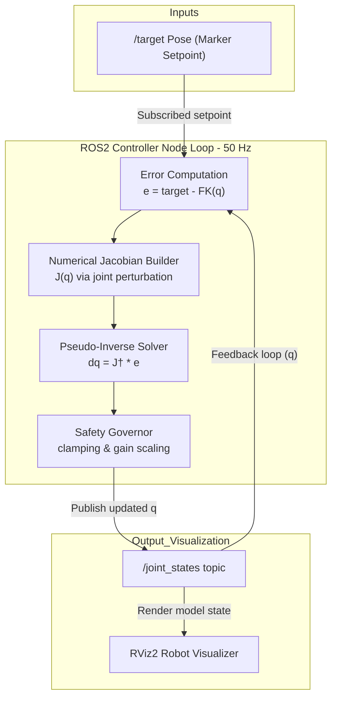

# Real-Time Inverse Kinematics for 6-DOF Robot Arms

A numerical Inverse Kinematics (IK) solver that drives a 6-DOF robotic manipulator to track arbitrary end-effector target positions in real time. Built using the Jacobian pseudo-inverse method with adaptive gain control, operating at 50 Hz within the ROS2 ecosystem.

Inverse kinematics serves as the mathematical bridge mapping Cartesian coordinates to joint angles. This project implements this controller from scratch, providing full visibility into the numerical control loop driving manipulator kinematics.

---

## System Architecture



The controller executes a deterministic feedback loop structured as follows:
1. **Forward Kinematics**: Computes the end-effector transform matrix chain using active joint states.
2. **Error Evaluation**: Evaluates the Euclidean distance vector between the target position and current end-effector.
3. **Numerical Jacobian**: Evaluates sensitivity columns by perturbing each joint angle by a small step.
4. **Pseudo-Inverse Solver**: Updates joint angles using the Moore-Penrose pseudo-inverse of the Jacobian.
5. **Safety Constraints**: Restricts the maximum joint speed and scales output increments to prevent singular behaviors.
6. **State Publication**: Publishes joint angles to visualization interfaces.

---

## Technical Deep-Dive

### Forward Kinematics

The Cartesian pose of the end-effector is calculated by chaining homogeneous transformation matrices from the base link to the tip:

$$T_{base}^{ee} = T_0^1(q_1) \cdot T_1^2(q_2) \cdot \ldots \cdot T_5^6(q_6) \cdot T_6^{ee}$$

Each transformation matrix translates and rotates coordinate frames depending on joint configuration $q$.

### Jacobian Pseudo-Inverse

The Jacobian matrix mapping joint rates to Cartesian velocity vector is defined by:

$$\dot{x} = \mathbf{J}(q)\,\dot{q}$$

The solver computes updates to joint positions by inverting this mapping using the Moore-Penrose pseudo-inverse:

$$\Delta q = \mathbf{J}^{\dagger} \Delta x = \mathbf{J}^T(\mathbf{J}\mathbf{J}^T)^{-1} \Delta x$$

This formulation yields the minimum-norm update vector, producing smooth joint movements and resolving kinematic redundancy.

### Numerical Differentiation

To maintain robot independence, the Jacobian columns are calculated numerically:

$$J_{ij} \approx \frac{f_i(q + \epsilon\, e_j) - f_i(q)}{\epsilon}$$

This perturbation approach allows the node to support arbitrary URDF definitions without analytical re-derivation.

### Stability Controls

| Method | Mechanics | Purpose |
|---|---|---|
| **Fixed-Gain Scaling** | Scaling step size by 0.01 | Damps oscillations and prevents target overshoot |
| **Output Clamping** | Clamping updates to ±0.125 rad | Prevents joint velocity spike instability near singularities |
| **Deadband Convergence** | Threshold limit of 0.01m | Settles controller updates when target is reached |

---

## Quick Start

### Prerequisites
- ROS2 Jazzy
- Python 3.10+
- NumPy

### Build & Execution

```bash
# Compile package
cd ROS2
colcon build --symlink-install
source install/setup.bash

# Run controller node
ros2 run py_package robot_controller
```

### Visualizing State
```bash
# Run visualizer (configured to listen to joint states and setpoints)
# Robot model local path: src/py_package/meshes/robot.urdf
ros2 launch urdf_tutorial display.launch.py model:=/path/to/src/py_package/meshes/robot.urdf
```

---

## Project Structure

```
ROS2/
├── src/py_package/
│   ├── py_package/
│   │   ├── robot_controller.py   # Main IK solver node
│   │   └── turtle.py             # Utility node
│   ├── meshes/                   # Manipulator design assets
│   ├── setup.py                  # Build scripts
│   └── package.xml               # Package manifest
├── docs/                         # Portfolio landing page
│   ├── index.html
│   └── style.css
└── README.md                     # Documentation
```
