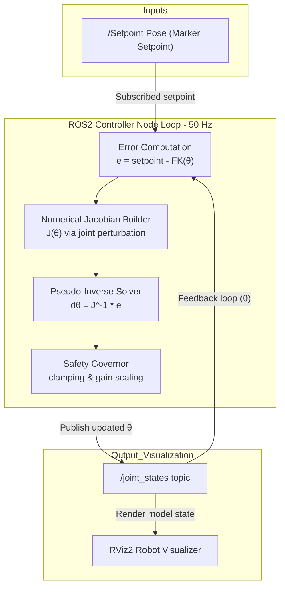

# 6-DOF Inverse Kinematics — Real-Time ROS2 Controller

Compact reference for the numerical IK controller that runs as a ROS2 node. The implementation uses a numerical Jacobian and the Moore-Penrose pseudo-inverse to compute joint updates that track Cartesian setpoints at a deterministic 50 Hz update rate.

This README focuses on: A concise system overview, the control loop and safety measures. How to build and visualize the node. A indepth and interactive walkthrough of the mathematical derivations.

---

## Overview

A numerical IK controller node for 6-DOF manipulators that converts Cartesian setpoints into joint updates using only the Forward Kinematics function and finite-difference Jacobian estimation. Designed for clarity and portability: deterministic timer callback and built-in safety limits to prevent unstable motion.

---

## System Architecture



The controller executes a deterministic feedback loop structured as follows:

1. Forward Kinematics: chain homogeneous transforms (t1..t7) to compute the end-effector pose in world frame.
2. Error Evaluation: compute e = setpoint_position - current_ee_position.
3. Numerical Jacobian: perturb each joint by ε = 0.01 and re-run FK to assemble a 3×6 Jacobian Matrix.
4. Pseudo-Inverse Solve: compute the minimum-norm joint update using the Moore–Penrose pseudo-inverse (NumPy pinv).
5. Safety Governor: apply a loop gain (0.01) and clamp each joint increment to ±0.125 rad before committing.
6. Publish: /marker (EE), /setpoint (goal) and /joint_states for visualization in RViz2 and feedback in the next cycle.

---

## Technical Deep-Dive

### Forward Kinematics

Determining the current spatial position of the manipulator requires chaining coordinate frame mappings from the base mount to the end-effector. This homogeneous transformation matrix is resolved using the configuration vector:

$$
T_{fk}(\vec{\theta}) = T_1(\theta_1) \cdot T_2(\theta_2) \cdot \dots \cdot T_6(\theta_6) \cdot T_{ee}
$$

This chaining function uses dimensions extracted from the robot geometry parameters file (URDF file) to convert joint rotations into a single 4×4 matrix defining Cartesian frame coordinate properties.

### Jacobian Mapping & Pseudo-Inverse

The Jacobian matrix maps velocities between joints' rotation space and Cartesian movement space:

$$
\vec{v} = J(\vec{\theta}) \cdot \vec{\omega}
$$

Because the controller node needs to translate a desired movement vector into state updates for the manipulator joints, this relationship was solved using the Moore–Penrose pseudo-inverse representation:

$$
\Delta \vec{\theta} = J^T \cdot (J J^T)^{-1} \cdot \vec{d}_{error}
$$

This mathematical mapping identifies the joints' state updates that satisfy positional setpoints while minimizing displacement magnitude, helping resolve redundant joint paths.

### Numerical Perturbation Solver

To ensure that this controller node can run on multiple designs without manual configuration, the columns of the Jacobian are evaluated numerically. The joint configurations are perturbed by a small interval $\epsilon = 0.01$:

$$
J_{row,j} = \frac{T_{fk}(\vec{\theta} + \epsilon \cdot \hat{e}_j) - T_{fk}(\vec{\theta})}{\epsilon}
$$

This numerical approximation extracts directional sensitivities using only the Forward Kinematics function, making the solver compatible with arbitrary joint structure modifications.

### Controller Safety Governor

Control loops operating near singular physical limits can generate excessive joint velocity updates. The node incorporates stability scaling and bounding rules to maintain controlled motion:

| Control Parameter     | Operational Setting | Functional Purpose |
|-----------------------|--------------------:|-------------------|
| Fixed-Gain Scaling    | 0.01               | Reduces step magnitude to prevent target overshoot |
| Output Clamping       | ±0.125 rad         | Prevents angular speed spikes near singularities |
| Convergence Threshold | 0.01 m deadband    | Settles solver updates once target proximity is reached |

---

## Quick Start

### Prerequisites
- ROS2 Jazzy
- Python 3.10+
- NumPy

### Build & Execution

```bash
# Compile package
cd ROS2
colcon build --symlink-install
source install/setup.bash

# Run controller node
ros2 run py_package robot_controller
```

### Visualizing Robot
```bash
# Launch RViz with robot model absolute path (local path: src/py_package/meshes/robot.urdf)
ros2 launch urdf_tutorial display.launch.py model:=/path/to/src/py_package/meshes/robot.urdf
```

---

## Project Structure

```
ROS2/
├── src/py_package/
│   ├── py_package/
│   │   ├── robot_controller.py   # Main IK solver node
│   │   └── turtle.py             # Utility node
│   ├── meshes/                   # Manipulator design assets (URDF/meshes)
│   ├── setup.py                  # Build scripts
│   └── package.xml               # Package manifest
├── docs/                         # Portfolio landing page
│   ├── index.html
│   └── style.css
└── README.md                     # Documentation
```
